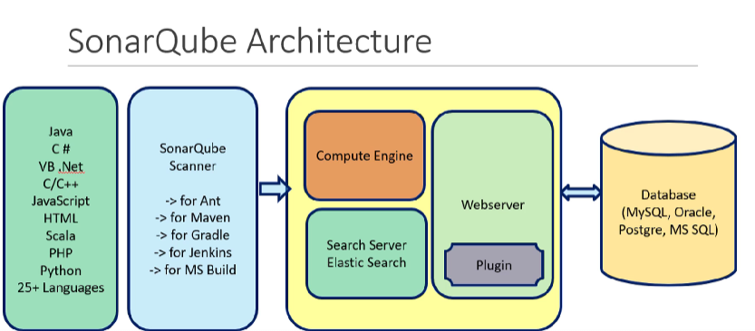

# SonarQube
SonarQube - Local Setup / Self hosted
SonarCloud - hosted on cloud
- It supports many programming languages

# 3 components
- Scanner - for ant, maven, gradle, jenkins, MS build
- Server - Compute Engine (takes report from scanner - analyse, digest and sent to database), Search Server (powered by elasticsearch which search the results faster and display) and Web Server (Web Server can have multiple plugins for UI)
- Database - reports sent - integrated with MS SQL, MySQL, Oracle

### Why ?
- Checks code quality for potential bugs
- Various rules are there for code checks
- Coding rules
- Test Coverage
- Duplication of Code
- Code Complexity

### Installation
- Require Java8 - [https://www.java.com/download/ie_manual.jsp] - Search java Folder and Set ENvironment variable - cmd -> java -h
- Download - [https://www.sonarsource.com/products/sonarqube/downloads/]
- Unzip and Run [bin/windows/SonarService.bat] script
- 
